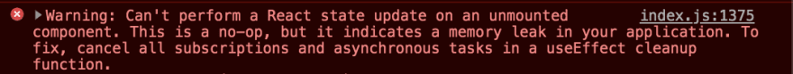

Today I'm we're gonna talk a little about react hooks api, and how you can use it to simplify your
work, creating your own hooks for your usecases and take advantage of this feature. *It is not* my
goal here to explain how hooks works. I will talk a little about it, and we will go through the
implementation.

Let's start listing the acquirements you must know to follow through this post. I will list here,
together with their docs. That way you will have the source to study it later.

1. React [here](https://reactjs.org/)
2. React Hooks [here](https://reactjs.org/docs/hooks-intro.html)
3. Javascript [here](https://developer.mozilla.org/en-US/docs/Web/JavaScript)

At this point, I will asume that you have all these skills. My goal here is not to create a tutorial
blog like `Medium`, so I will try to be quick and objective on how I did this, and any questions
you can make me on my [Linkedin](https://www.linkedin.com/in/rafaelcmm/). I'm always available.


## What we're gonna do

We will talk about React Hooks, how you can use this library to achieve good stuff in your application
without needing to use any libraries for that. I will show a little snippet of a hook, then talk about
two implementation samples.

## First things first

I will assume that you know the basics of hooks library like useState, useEffect. If doesn't, just check the follow code:

useState:
```javascript
const MyFancyComponent = () => {
  const [foo, setFoo] = useState('')

  return (
    <div>{foo}</div>
  )
}
```

Here we are simply defining a state variable called `foo`, and also its set function called `setFoo`. We
define those using the hook useState, that initializes our variable with an empty string, and returns its
and its set function.

Now, whenever we want to change `foo` value, just call `setFoo` and this function will do the equivalent
of our old `setState`. It will change the value of `foo` and update the view. 

useEffect:
```javascript
const MyFancyComponent = () => {
  const [foo, setFoo] = useState('')

  useEffect(() => {
    console.log(`My fancy foo is: ${foo}`);
  }, [foo]);

  return (
    <div>{foo}</div>
  )
}
```

Now, with useEffect hook, we are basely defining something like our `componentDidMount`, `componentDidUpdate`
lifecycles. We are defining a hook that will trigger once, on component render, then every time `foo`
changes (as defined on dependency array).

So, everytime `foo` changes, it will log our new fancy foo.

## The cleanup function

Now, sometimes when we are dealing with async/await functions in javascript. Imagine that we are doing
some cool async heavy processing operation inside our hook, and suddenly the user navigates to other
page (or whatever reason the component unmounts).

We will trigger this error: 


To prevent memory leaks like those, we need to always cleanup our hooks when we are executing api calls,
timeouts, our wherever other async stuff you are executing inside it. Luckly for us, we have an easy
way to do this. React Hooks API allow us to return inside of the hook function, another function that
cleans the hook

> Talk is cheap, show me the code.

```javascript
const MyFancyComponent = () => {
  const [foo, setFoo] = useState('')

  useEffect(() => {
    const setTimeoutId = setTimeout(() => console.log(`My fancy foo with delay is: ${foo}`), 1000)
    return () => clearTimeout(setTimeoutId);
  }, [foo]);

  return (
    <div></div>
  )
}
```

We just need to return inside our useEffect hook, a function that cleans wherever we need to clean.
In this scenario, we are defining a hook, that will log `foo`, but only after a sec. If the foo
value changes before that, we would have a problem, *but*, when we are returing the cleanup function
inside the hook, we `ensure` that the timeout will be cleaned every time `useEffect` triggers, or when
the component unmount. 

> Cleaning up these kind of op (that is common in most of systems) can seem useless. The error
> itself said it is no-op. But even if it isn't, we need to prevent this memory leaks to ocurr to
> improve our application.

# The useDebounce hook

> Talk is cheap, show me the code.

```javascript
const useDebounce = (value, delay = 500) => {
  const [debouncedValue, setDebouncedValue] = useState(value);

  useEffect(() => {
    const handler = setTimeout(() => {
      setDebouncedValue(value);
    }, delay);

    return () => {
      clearTimeout(handler);
    };
  }, [value, delay]);

  return debouncedValue;
};
```

Now, I choose this sample as our first custom hook because it looks like what we showed in the previous
example. 

Here we are creating a hook to debounce the value of something. I will not explain about throttle and
debounce here. You can check this cool [article](https://programmingwithmosh.com/javascript/javascript-throttle-and-debounce-patterns/)
for this. 

So, what we are doing here is simply defining a debouncedValue, and initializing it with the value,
defining a `useEffect` and returning the debouncedValue. The trick here is, since this hook has a
timeout inside it, the changes on the debouncedValue will only take effect after a debounced time.
If the value changes before it, the `clearTimeout` will be triggered and a new handler registered.

With this simple block of code, we can call `useDebounce` on any place of our React application, and
we will have a quick and useful debounce feature.

#The useInterval hook

Here I needed to achieve something like a `polling` feature, when we have a callback function and we
want to run it time from time. 

> Talk is cheap, show me the code.

```javascript
const useInterval = (callback, delay = 10000) => {
  const savedCallback = useRef();

  useEffect(() => {
    savedCallback.current = callback;
  }, [callback]);

  useEffect(() => {
    function tick() {
      savedCallback.current();
    }
    
    const intervalId = setInterval(tick, delay);
    return () => clearInterval(intervalId);
  }, [delay]);
};
```

Now we are defining a hook that receives a delay and a callback. We are defining a hook to store the
last callback reference (using a `useRef`) inside a useEffect. So, everytime callback changes, it will
store the last reference inside it. 

Inside the second `useEffect`, we are creating a `setInterval`, that will execute the callback in a time,
and we are cleaning the interval to avoid async errors.

And that's it! Now it's up to you. Study hooks api to create your own custom hooks, and share with
the community if you develop something new and useful!
Hope you have enjoyed it, any suggestions just chat me on my [linkedin](https://www.linkedin.com/in/rafaelcmm/) 
and I will be glad to answer it.
                                                  
See you tomorrow! (I hope so).