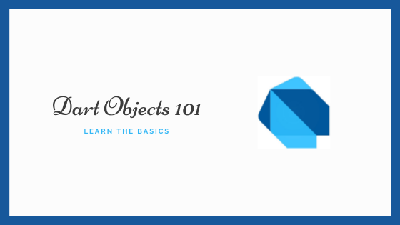

Today I'll gonna show you how empower your dart objects in your application. Now with Flutter framework
in ascension, it is very common to see devs from javascript to talk something like `uh, it is boring
have to write objects.` I also will not dive into packages like `json_serializable`. I will try to keep
it as clean as possible, so you can understand some initial concepts.

Let's start listing the acquirements you must know to follow through this post. I will list here,
together with their docs. That way you will have the source to study it later.

1. Dartlang [here](https://dart.dev/)

At this point, I will asume that you have all these skills. My goal here is not to create a tutorial
blog like `Medium`, so I will try to be quick and objective on how I did this, and any questions
you can make me on my [Linkedin](https://www.linkedin.com/in/rafaelcmm/). I'm always available.



## What we're gonna do

We will dive into the principles of dart objects, and how we can use them to free our mind from javascript
`no type at all` paradigm, and see the beneficts of a OO language again.

## First things first

I will assume here you know how to do the basics of dart lang for this: create a class and construct it.
If doesn't, just check the follow code:

```dart
// Declaring the class
class Foo {
  // Defining attributes
  String bar;
  
  // Defining constructor
  Foo(String bar) {
    bar = bar;
  }
}
```

Now let's dive into the good stuff

## Shortening constructors

> Talk is cheap, show me the code.

```dart
class Foo {
  final String bar;
  final String bazz;
  
  Foo(this.bar, this.bazz);
}
```

Here we are defining an object with two `final` properties, `bar` and `bazz`. Since they are final, 
that means we can change their values after the object is instantiated. We can't do that even on
the constructor, so, if we try to do something like this:

```dart
class Foo {
  final String bar;
  final String bazz;
  
  Foo(String bar, String bazz) {
    bar = bar;
    bazz = bazz;
  }
}
```

We will get an error like this:


That means that we need to initialize every final property, and the previous constructor does that for us.

```dart
class Foo {
  final String bar;
  final String bazz;
  
  Foo(this.bar, this.bazz);
}

Foo('bar', 'bazz');
```

So, if we need to initialize every final property, why the previous method didn't worked and this worked?

When we define constructors like this, dart knows that, in the moment of object instantiation, he should
get the two `positional parameters` on the instantiation and attribute to it's equivalents on the
object. That way it's we can protect our properties with final and simplify our constructor.

## Positional parameters X Named parameters

> Talk is cheap, show me the code.

```dart
class Foo {
  final String bar;
  
  Foo(this.bar);
}

class Bar {
  final String foo;
  
  Bar({this.foo});
}
```

So, the difference between these two objects are the `{}`. Why should we care about that? Well, this
means a lot in our objects, because the first one defines positional paramenters (mandatory), and the
other defines named parameters (optional). That way we can define in our system what is mandatory for
our object to have, and what is not, reducing a lot bugs for unexpected nulls.

```dart
// This will return an error, because the bar positional parameter is mandatory
Foo();

// This will be ok, because foo named parameter is optional.
Bar();

// Doing this, we are defining a final value for bar attribute, and filling the mandatory rule
Foo('bar');

// Doing this we are defining a final value for 'foo' named parameter (that's why is named)
Bar(foo: 'foo');
```

## Virtual properties with get

> Talk is cheap, show me the code

```dart
class Person {
  String firstName;
  String lastName;
  String get fullName => '${firstName} ${lastName}';
  
  Person({ this.firstName, this.lastName });
}
```

A simple but really common use case for a virtual parameter is that. A lot of times, our API returns
for us just first and last name for a person, but we almost always need to show for the user the
entire name. Instead of spread this concatenation in the entire system, we can just define a `get`
parameter on our object, that does this for us. That way, we can access this `function` as we
access any parameter

```dart
Person person = Person(firstName: 'Foo', lastName: 'Bar');

// It will print '${firstName} ${lastName}'
print(person.fullName);
```

## Generating factories

Talking about API, it is really common for dart beginners to struggle with transforming json objects
from API into their corresponding objects. Since we will not use any libs like `json_serializable`,
the best way to achieve this with pure code is using factories. 

> Talk is cheap, show me the code

```dart
class Foo {
  final String bar;
  
  Foo({this.bar});

  factory Foo.fromJson(Map<String, dynamic> json) {
    return Foo(bar: parsedJson['bar'] as String);
  }
}
```

Here we are defining an object `Foo` and it's constructor. The new here is the factory definition. This
approach allow us to map a json we commonly receive from API source, and return an instantiated object
from it. Commonly we want to strict our objects to only be instantiated by it's factories, so we can
also turn our constructors private. That way we can only instantiate by using our factories.

We can do that by:

```dart
Foo._({this.bar});
```

So, a final example would be something like:

```dart
class Foo {
  final String bar;
  
  Foo._({this.bar});

  factory Foo.fromJson(Map<String, dynamic> json) {
    if (parsedJson['bar'] != 'bar') {
      throw 'The property is not bar';
    }

    return Foo(bar: parsedJson['bar'] as String);
  }
}
```

Now, everyone who want's to instantiate our object `Foo` will need to use it's factory `.fromJson`, and
in there we validate if the json `bar` property is really bar, and if it doesn't, we just throw an error.

And that's it! Now it's up to you. Study dart object implementation to check how you can perform
more solutions like that, and share with the community if you develop something new and useful!
Hope you have enjoyed it, any suggestions just chat me on my [linkedin](https://www.linkedin.com/in/rafaelcmm/) 
and I will be glad to answer it.
                                                  
See you tomorrow! (I hope so).