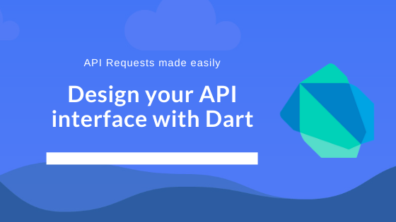

Today I'm gonna show you how I created a simple api interface handler for my dart application, to
resolve my API calls better. My goal here is simplify the `http package` interface, to get
more clear code inside my repositories. 

Let's start listing the acquirements you must know to follow through this post. I will list here,
together with their docs. That way you will have the source to study it later.

1. Dartlang [here](https://dart.dev/)
2. Dart http package [here](https://pub.dev/packages/httprest)
2. REST in this [article](https://www.codecademy.com/articles/what-is-rest)

At this point, I will asume that you have all these skills. My goal here is not to create a tutorial
blog like `Medium`, so I will try to be quick and objective on how I did this, and any questions
you can make me on my [Linkedin](https://www.linkedin.com/in/rafaelcmm/). I'm always available.



## What we're gonna do

We are gonna abstract some features from `http` dart package and write something more useful for us, 
and readable for our devs. My goal here is not dive into the implementation, but to explain what I
did for my usecase. 

You can do the same, to fulfill your usecase, with a different implementation.

## First things first

I will assume here you know how to do the basics of dart lang for this: create a class and construct it.
If doesn't, just check the follow code:

```dart
class MyClass {
  final String foo;
  
  MyClass({ this.foo });
}
```

## Defining our API wrapper

> Talk is cheap, show me the code

```dart
class Api {
  final String _baseUrl = 'https://<YOUR_BASE_URL>';
  final String _basePath = '/api/v1';
  Map<String, String> _headers = {
    'Content-Type': 'application/json',
    'Accept': '/',
    'Origin': '<YOUR_ORIGIN>'
  };
}
```
Here we are defining some ground stuff for API to work. The goal here is to define base things that 
will not change on the entire application, so we don't need to write our entire URL when performing
http requests. 

These class properties are private, we don't want anyone messing with it (yet).

## Dart singleton

> Talk is cheap, show me the code

```dart
class Api {
  ...
  // singleton impl
  static Api _instance = Api._internal();
  Api._internal();
  factory Api() => _instance;
  // end singleton impl
  ...
}
```

It is important to my usecase that Api class to be a singleton. Once we add the access token here,
we will never need to care about it anymore when performing our requests. I will not dive into
singleton explanation, It is just initializing a private instance of the class, and defining a
factory that every time the object is constructed, it will just return that instance.

You can check more about dart objects [here](https://5am-dev.netlify.com/dart-objects-101/)

## Injecting token

> Talk is cheap, show me the code

```dart
class Api {
  final String _baseUrl = 'https://<YOUR_BASE_URL>';
  final String _basePath = '/api/v1';
  Map<String, String> _headers = {
    'Content-Type': 'application/json',
    'Accept': '/',
    'Origin': '<YOUR_ORIGIN>'
  };

  ...

  void injectAuthorization(String token) {
    assert(token != null);
    // You can add some other token/authorization validations here
    _headers['authorization'] = token;
  }
}
```

I just need to create an inject method that will receive a auth token,do some asserts you need to
do, and inject the token into our headers. Since our class is a `singleton`, we just need to do it
once (normally inside a login screen or something like that), and all the other requests we perform
in our application will be authenticated.

> Do not leave it like that. For more security, always remember to clear auth tokens
> when user performs logout. The implementation is simple, so I will not do it here. 

## Implement your own REST interfaces

Now that we have a background structure, we can just implement our `post`, `get`, `put`, `delete`,
`patch` methods. 

I will not implement all of these here, but the logic behind the implementation is the same. I will
show `get` implementation for basis

> Talk is cheap...

```dart
class Api {
  ...
  Future<Response> get(String path, {Map<String, dynamic> params}) async {
    Uri uri = Uri(
      scheme: 'https',
      port: 8800,
      host: _baseUrl,
      path: _basePath + path,
      queryParameters: params);
    
    return Response(await http.get(uri, headers: _headers));
  }
}
```

Now, instead of the pure usage of `http` package, in our repositories, we will not need to repeat
this block of code every time (Create an Uri, Parse JSON, Define headers...). With that, we just
need to call in our repositories

```dart
class MyFancyRepo {
  final Api api = Api(); // Returning our singleton instance, authorized or not

  Future<User> getUser(String userId) async {
    Response response = await api.get('/user', params: { 'id': userId });
    // Map your response body inside your entity objects and be happy
    ...
  }
}
```

Now we completed our goal! Instead of having to build the entire URI, define headers and other stuff
that our repositories doesn't need to know, we created a gateway between the http package and our
repositories, and we just need to have our paths and parameters for make our api requests.

And that's it! Now it's up to you. Study dart http package implementation to check how you can perform
more solutions like that, and share with the community if you develop something new and useful!
Hope you have enjoyed it, any suggestions just chat me on my [linkedin](https://www.linkedin.com/in/rafaelcmm/) 
and I will be glad to answer it.
                                                  
See you tomorrow! (I hope so).