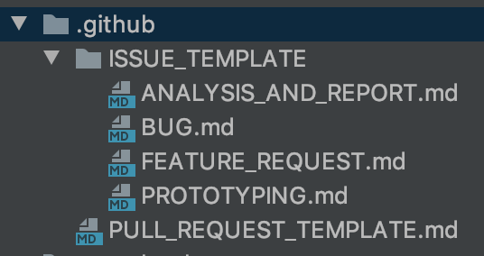

Picture a scenario: You created a small and cool package for the community of the technology that you
are working. This package starts to get famous, with 10 stars, 100 stars, 1000 stars... And so that
begins. With a lot of people using your package, it is common to have more and more issues opened,
more pull requests, more feature requests, and your issues started to get unreadable because
everyone writes the issues on a different way.

Picture other scenario: You are part of a company that has a cool app as a product. Your app starts with
100 users, then 1000 users, then 1.000.000 users. Your support team starts to receive a lot of requests
and then you see a lot of issues, written in different forms on your project. How you will manage that?

The goal here is to show you some useful github templates you can add to your project, to normalize
your issues to clarify your tasks and keep the PR's more readable.

Let's start listing the acquirements you must know to follow through this post. I will list here,
together with their docs. That way you will have the source to study it later.

1. Markdown syntax [here](https://www.markdownguide.org/cheat-sheet/)

At this point, I will asume that you have all these skills. My goal here is not to create a tutorial
blog like `Medium`, so I will try to be quick and objective on how I did this, and any questions
you can make me on my [Linkedin](https://www.linkedin.com/in/rafaelcmm/). I'm always available.


## What we're gonna do

We are create some basic markdown files to add in your project. Once you add it to your repository, you
will be able to write issues and pull requests from a normalized template, instead of the free
writing model.

## First things first

I will assume here you know how to do the basics of markdown for this. If doesn't, just check the link
of markdown syntax above.

> For remember: The samples I will show here are not rules. You can write these templates
> in any way you think will be more clear to your team. Be creative!

## Adding templates folder to your repository

First, no matter the language you are working on, you will create a folder called `.github` inside
your projects root, and another called `ISSUE_TEMPLATE` inside it. Your structure will end like
this:



## Defining your templates

Now you defined the folder structure, you can create your templates for each case your project
requires. In the sample image, I created a pull request template (always at `.github` root), and 
four issues templates (analysis, bug, feature request and prototyping).

You must study what are your project usecases and define your own templates.

As I said before, this is not a tutorial of how to do each template. I will show you how to create
a simple template and you will go from here

## Pull request template 

The goal of creating a pull request template is to guide the dev who is opening it in how to better
describe the PR changes, to learn best practices of title writing and to check the steps he needs
to ensure before open the pr.

> Talk is cheap, show me the code.

```markdown
<!-- 
  Define some title rules inside this first comment
-->

## Description

<!-- 
  Define some description rules to write below like listing what the changes do, what behaviors changed
-->

*...*

## Developer checklist

<!-- 
  Before you create this PR confirm that it meets all requirements listed below by checking the relevant checkboxes (`[x]`). 
  This will ensure a smooth and quick review process.
-->

- [ ] All existing and new tests are passing.
- [ ] Lint check is passing.
- [ ] All CircleCI steps are passing.

## Is a breaking change

<!-- 
  A simple check if this PR is a breaking change
-->

- [ ] YES
- [ ] NO
```

This is just a guideline. You must improve it with your rules and best practices for pull requests
and write a template that will be useful for your team.

## Issue template

Now, inside our `ISSUE_TEMPLATE` folder, you will write other templates for each case you need. You can
write templates for bugs, feature requests, analysis, questions, and any other use cases you want to.

> Talk is cheap, show me the code

```markdown
## Use case
<!--
     Please tell us the problem you are running into that led to you wanting
     a new feature.

     Is your feature request related to a problem? Please give a clear and
     concise description of what the problem is.

     Describe alternative solutions you've considered.
-->

## Proposal

<!--
     Briefly but precisely describe what you would like the app to be able to do.
     Consider attaching images showing what you are imagining. (Strongly suggested)
-->

## Business rules

<!--
     Briefly but precisely describe any logical rules this feature must follow
     Example: This foo only can be registered if bar is valid
-->

## Additional information

<!--
     Add any other informations/screenshots that can be useful to this feature
-->
```

It is basely the same structure of a pull request template. The new here is the header section. You
can add infos like name, title, about, labels and assignees to a `---` block at the top of your
markdown. That way github will map the name, a description, some labels you attribute automatically
for each type of issue, some main assignee on your team for bugs, or features, or anything.

And that's it! Now it's up to you. Study markdown language to personalize your templates, and 
share with the community if you write something new and useful!

Hope you have enjoyed it, any suggestions just chat me on my [linkedin](https://www.linkedin.com/in/rafaelcmm/) 
and I will be glad to answer it.
                                                  
See you tomorrow! (I hope so).