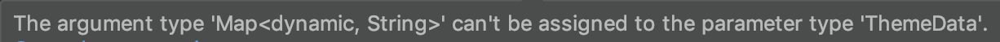

Today I'll gonna show you how to use Flutter themes to personalize your app and provide to your users a
great new experience. 

Let's start listing the acquirements you must know to follow through this post. I will list here,
together with their docs. That way you will have the source to study it later.

1. Dartlang [here](https://dart.dev/)
2. Flutter [here](https://flutter.dev/)

At this point, I will asume that you have all these skills. My goal here is not to create a tutorial
blog like `Medium`, so I will try to be quick and objective on how I coded this blog, and any questions
you can make me on my [Linkedin](https://www.linkedin.com/in/rafaelcmm/). I'm always available.

## What we're gonna do

We will simply define two themes, a light and a dark theme (nothing new here), and define some dynamic
rules to choose the current template.


## First things first: How flutter theme works

Flutter provides us an implementation of `StatefulWidget` called `MaterialApp`. This will be your
initial widget, and from here you will define your routes, themes and other useful stuff. If you are
already a flutter developer, there is nothing new here.

We are gonna focus on `theme` attribute of `MaterialApp`. Dart is a highly typed object-oriented
language. So, if you are using an IDE like `IntelliJ`, `Android Studio` or a smart code editor like
`VSC`, if you try to pass anything into MaterialApp theme:

```dart
class MyApp extends StatelessWidget {
  @override
  Widget build(BuildContext context) {
    return MaterialApp(
        ...
        theme: { foo: 'bar' },
        ...
    );
  }
}
```

It will result in something like this: 



>As a typed language, Flutter defines an object to wrap our themes. This object is called `ThemeData`.
>You can use it to wrap your theme info, and pass a valid theme to the MaterialApp.

## How to correctly create a theme?

After explain how theme works, implement and use themes in your Flutter app becomes quite simple. 
You just need to define your `ThemeData`, and pass it to your material app. So:

1. In your `theme.dart`

```dart
/* You MUST study ThemeData implementation to check all the parameters you can pass to 
ThemeData and build the fanciest theme possible  */

ThemeData MyFancyTheme = ThemeData(
      brightness: Brightness.light,
      primaryColor: Colors.indigo[500],
      accentColor: Colors.deepPurple[500],
      dividerColor: Colors.black54,
      errorColor: Colors.redAccent,
      fontFamily: 'Quicksand');
```

2. In your `main.dart`

```dart
class MyApp extends StatelessWidget {
  @override
  Widget build(BuildContext context) {
    return MaterialApp(
        ...
        theme: MyFancyTheme,
        ...
    );
  }
}
```

And... that's it. There is no secret at all in how to define themes in Flutter. But how can we turn
this static theme into a cool dynamic theme? 

## Turning common into cool dynamic

Using what I show until now, you can create dynamic themes, and change your app between they, to give
your user a different experience. 

Now we will create a few things. We will create an utils class that we will call `ThemeUtils`, and
wrap our two themes here, the `light` and the `dark` theme. After that, we are gonna create a simple
logic, to identity the hour of the day and display the light theme by day, and the dark theme by night.

With that, our user will never experience the `brightness shock`, always having a confortable vision
of our interface. Let's code

- Create your `ThemeUtils` inside `theme.dart`, and define our static themes

```dart
class ThemeUtils {
  static final ThemeData light = ThemeData(
    brightness: Brightness.light,
    primaryColor: Colors.indigo[500],
    accentColor: Colors.deepPurple[500],
    dividerColor: Colors.black54,
    errorColor: Colors.redAccent,
    fontFamily: 'Quicksand');

  static final ThemeData light = ThemeData(
    brightness: Brightness.dark,
    primaryColor: Colors.indigo[500],
    accentColor: Colors.deepPurple[500],
    dividerColor: Colors.black54,
    errorColor: Colors.redAccent,
    fontFamily: 'Quicksand');
}
```

We wrapped our themes into static attributes in our `ThemeUtils`. Now, if we want to access our themes,
we just need to call static `ThemeUtils.dark` or `ThemeUtils.light`

Tip:
> Since our themes are static attributes, we don't need to instantiate ThemeUtils object. Otherwise,
> We would need to do something like `ThemeUtils().nonStaticTheme`. This can be useful. In the future,
> you can pass to `ThemeUtils` constructor somethings like dynamic `primaryColor` or `accentColor`, 
> and change your dynamic themes with that. Use your imagination ;)

- Create your theme logic inside `ThemeUtils`, to define a rule that chooses what theme will be 
displayed for the user

```dart
class ThemeUtils {
  // Our static themes
  ...

  // Not the best implementation, just to show some readable code of what we are doing
  static ThemeData getTheme() {
    DateTime now = DateTime.now();

    if (now.hour >= 18 || now.hour <= 5) {
      return dark;
    }
    return light;
  }
}
```

Now we are creating a simple rule. As the code says, if we are after 6PM and before 5AM, we will
display the dark theme. Otherwise, we will display the light theme.

- Now, in our `main.dart` we just need to...

```dart
class MyApp extends StatelessWidget {
  @override
  Widget build(BuildContext context) {
    return MaterialApp(
        ...
        theme: ThemeUtils.getTheme(),
        ...
    );
  }
}
```

And that's it! Now it's up to you. Study Flutter themes documentation to check how you can deliver
unique experiences to your users. Be imaginative. 
Hope you have enjoyed it, any suggestions just chat me on my linkedin and I will be glad to answer it.
                                                  
See you tomorrow! (I hope so).