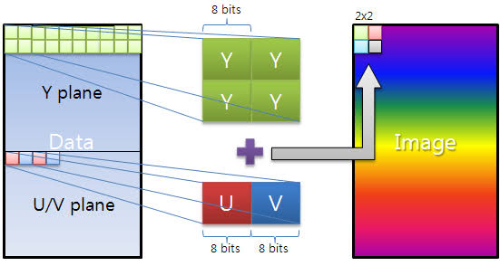

Today I'll gonna show you how to use some dart packages to manipulate files/images. 

Let's start listing the acquirements you must know to follow through this post. I will list here,
together with their docs. That way you will have the source to study it later.

1. Dartlang [here](https://dart.dev/)
2. Flutter [here](https://flutter.dev/)

At this point, I will asume that you have all these skills. My goal here is not to create a tutorial
blog like `Medium`, so I will try to be quick and objective on how I did this, and any questions
you can make me on my [Linkedin](https://www.linkedin.com/in/rafaelcmm/). I'm always available.

## What we're gonna do

We will create an utils class with some useful methods to help deal with images. I will show how it
was implemented then I will talk about the code.

## First things first

We are gonna create a simple class, that we are gonna call `MyImageUtils`, to wrap our image handling
functions. Most of these functions will be `static`, so they can be independent of class instantiation.

So, we simply start with 

```dart
class MyImageUtils {}
``` 

## Base64 Strings > Flutter image

> Talk is cheap show me the code...

```dart
class MyImageUtils {
    ...
    static Image imageFromBase64String(String base64) {
      return Image.memory(base64Decode(base64));
    }
    ...
}
```

Luckly, dart has wrapped a native way to encode base64 strings, and we can invoke it by calling
`base64Decode`. For further trial, you can implement the inverse logic with `base64Encode`.

This dart api decodes base64 strings, and returns an `Uint8list` (That is basely, a list of `int`
representing bytes). With that, you can call `.memory` factory from flutter `Image`, and it will generate
a screen presentable image to include in your UI stuff


## Flutter file > Base64 Strings

> Talk is cheap, show me the code...

```dart
class MyImageUtils {
  ...
  static Future<String> base64StringFromFile(File file) async {
    List<int> imageBytes = await file.readAsBytes();
    return base64Encode(imageBytes);
  }
  ...
}
```

I will not dive into this. We are basely getting a `File` (defined on `dart:io` native package) and
encoding to base64. This can be an image file or any other file on your application.

> Ok, until now we just talked about base64 > image flow. This is useful sometimes, but it's not
> our goal here. Let's talk about the good stuff

## Cropping images in dart

Before dive into this code, It would be nice to take a look at this great package [here](https://pub.dev/packages/image)
that we use for image handling. It is a complete dart package with 100 healthy overall, and to not
mix with Flutter `Image`, we will import using the syntax below:

```dart
import 'package:image/image.dart' as util;
```

Now, every time we need to use it, we just need to add the `util` prefix.

> Talk is cheap, show me the code...

```dart
class MyImageUtils {
  ...
  static Future<File> cropByteImage(List<int> bytes, Rect coordinates) async {
    final path =
        join((await getTemporaryDirectory()).path, '${DateTime.now()}.png');
  
    util.Image image = util.decodeImage(bytes);
  
    util.Image thumbnail = util.copyCrop(
        image,
        coordinates.left.toInt(),
        coordinates.top.toInt(),
        coordinates.width.toInt(),
        coordinates.height.toInt());
  
    File pngFile = await File(path)
      ..writeAsBytes(util.encodePng(thumbnail));
  
    return pngFile;
  }
  ...
}
```

Ok, what we are doing here is quite simple, let's dive a little into the code. First, we are receiving
a simple list of bytes (that you can retrieve from your flutter image from `Image.bytes`, or from
your image file with `File.readAsBytesSync`), and a Rect (from dart geometry) with the cropping
coordinates.

First, we use dart packages `path` and `path_provider` to generate an unique path under our temporary
directory. This will be useful for us to set this file in a place for a short period of time (it
will be cleaned if user doesn't download it).

Now we use our image library to get an `Image` object from bytes decoding (**not the flutter's Image**),
then we call our package's api `copyCrop` to copy the bytes with the Rect boundaries and return to us
a cropped thumbnail.

For curiosity, you can check out how this is done by looking into our image package

```dart
Image copyCrop(Image src, int x, int y, int w, int h) {
  // Attributing a new image with the desired width and height with the same props as old image
  Image dst = Image(w, h, channels: src.channels, exif: src.exif,
      iccp: src.iccProfile);

  // Using the boundaries to set the images pixels
  for (int yi = 0, sy = y; yi < h; ++yi, ++sy) {
    for (int xi = 0, sx = x; xi < w; ++xi, ++sx) {
      dst.setPixel(xi, yi, src.getPixel(sx, sy));
    }
  }

  return dst;
}
```

**Important:**

> As you can see, here we have an operation with matrix complexity. So depending on the image and it's
> boundaries, this can be really painful. To not lose frames on your Flutter application, I suggest you
> perform these operations under `compute`. That way, dart will run the operation under an `Isolate` and
> return to you asynchronously.

After that, we just need to encode our cropped image as PNG, store it on a new file that we created
using that path we created early, and return it to the user.

Here I decided to return just the file, so in our code, we can freely decide to enable user to
download it, or show on screen using `Image.file` (flutter's image).

## Convert CameraImage (from flutter_camera package) into a PNG.

Ok, here is the most painful operation we will show here, and do not be surprised if you need to use
this in your application usecase (this is really common, although it is not provided natively by the
camera package).

Whenever we want to create a widget using phone camera, we need to initialize the Camera Controller and 
start the image stream by calling `.startImageStream`. This method is a listener to our `CameraPreview`
widget, and it is always providing us the last image streamed wrapped on `CameraImage` object.

I will not dive into this part of the code today, just keep in mind that the CameraImage is useful if we need
to pass the image planes into our machine learning code and, for example, extract faces or texts from it,
but if we somehow want to get this image to become a normal, displayable and downloadable image, here
we will struggle, because this will be processing painful.

> Talk is cheap... ok, I will just show the code and comment the steps

```dart
class MyCameraUtils {
  ...
  static Future<List<int>> convertImagetoPng(CameraImage image) async {
      // Creates a new image from our image package
      util.Image img;
      
      /* Here we will check if the image is yuv420 type, or brga8888 type. In a way
         We are checking if this image is from Android (brga8888) or from iOS (yuv420).
         Depending on the case, we are going to apply a different algorithm. Here is where it hurts */
      if (image.format.group == ImageFormatGroup.yuv420) {
        img = _convertYUV420(image);
      } else if (image.format.group == ImageFormatGroup.bgra8888) {
        img = _convertBGRA8888(image);
      }
    
      // We are gonna just convert the new parsed image into a list of bytes, and return it.
      List<int> png = util.encodePng(img);
    
      // Now, we can use the camera image as a File, or Flutter image. yay.
      return png;
  }
  
  // Here we can use Image api to process the camera image, since we have the brga format available
  static util.Image _convertBGRA8888(CameraImage image) {
    /* We are just creating a new image from CameraImage's byte infos. We extract width, height
       The planes, and we generate a new image with BGRA format */
    return util.Image.fromBytes(
      image.width,
      image.height,
      image.planes[0].bytes,
      format: util.Format.bgra,
    );
  }
  
  // We don't have a easy way to do this with iOS yuv420 images so...
  static util.Image _convertYUV420(CameraImage image) {
    // Use use Image constructor to create a image buffer, that we will fill later
    var img = util.Image(image.width, image.height);
  
    /* We store the planes of the Camera image and attribute a shift value that we will use
       to calculate the pixels */
    Plane plane = image.planes[0];
    const int shift = (0xFF << 24);
  
    // We fill image buffer with plane[0] from YUV420
    for (int x = 0; x < image.width; x++) {
      for (int planeOffset = 0;
          planeOffset < image.height * image.width;
          planeOffset += image.width) {
        final pixelColor = plane.bytes[planeOffset + x];
        // color: 0x FF  FF  FF  FF
        //           A   B   G   R
        // Calculate pixel color
        var newVal = shift | (pixelColor << 16) | (pixelColor << 8) | pixelColor;
  
        img.data[planeOffset + x] = newVal;
      }
    }
  
    // Here we have the Image from a YUV420, that we will encode to png later.
    return img;
  }
  ...
}
```



I tried to keep the explanation of this code into the comments, so if you are going to copy/paste this,
you can check it later to perform any changes you need. 

The trick here is, if the developer quickly looks into this code, it will seem something like that:

> Oh no! Handling images in iOS is so painful and has so much complexity, this will be horrifying to
> maintain, help me!

But, for weird as it looks, the BRGA8888 processing on Android is way more heavy and painful. 

Perform this process in an average iOS phone (Like my iPhone 7 that I use for tests), takes, at maximum,
5 secs, and in high end devices like an iPhone 11, it is almost instant. But on android... it can take
20, 30 secs or more. This is way to much time to block our user.

So, on Android, I suggest you try to workaround it with `image_picker` package while flutter_camera
developers don't provide us a good way to handle CameraImage, but if you still need to use this on
android, make sure that you wrap it inside an `Isolate`, so you can run in another thread and not lose
frames on your application. With that you can also display some fancy loading to keep your user less
uncomfortable. 

And that's it! Now it's up to you. Study dart image package documentation to check how you can perform
more solutions like that, and share with the community if you develop something new and useful!
Hope you have enjoyed it, any suggestions just chat me on my [linkedin](https://www.linkedin.com/in/rafaelcmm/) 
and I will be glad to answer it.
                                                  
See you tomorrow! (I hope so).